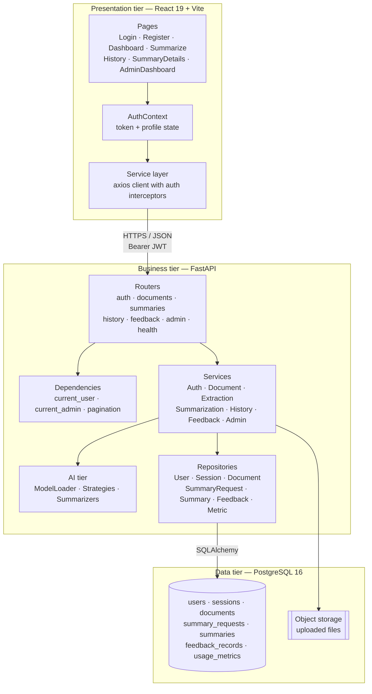
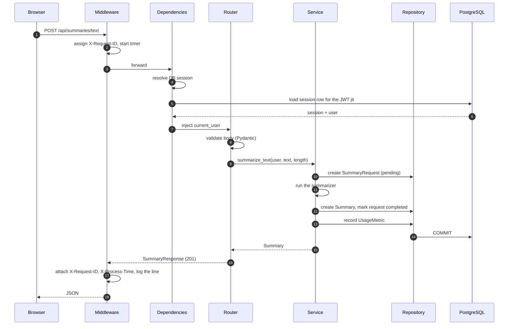
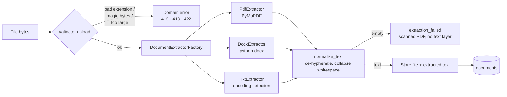
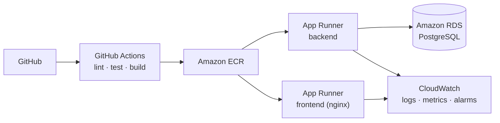

# Architecture

## Three tiers

The dependency arrows only ever point downward. Concretely:

- **Routers** never contain SQL or business rules. They validate the request with a Pydantic
  schema, call one service method and map the result to a response schema.
- **Services** never import FastAPI. They raise domain exceptions from
  `app/core/exceptions.py`, and a single handler in `app/main.py` translates those into HTTP
  status codes. This is why the business rules can be tested without a web server.
- **Repositories** are the only place a SQL query is constructed. Ownership filters live in
  the query itself, not in Python after the fact.

## Request lifecycle

Two details worth calling out:

- **The `SummaryRequest` row is written before the model runs.** If generation fails, the row
  is marked `failed` with the error message, so a failure is auditable rather than invisible.
- **Telemetry is written in the same transaction as the business change.** A summary and its
  usage metric commit together, so the admin dashboard can never disagree with the history.

## Data flow through a document upload

## Why SQLite in tests and PostgreSQL in production

The models use a `GUID` type decorator (`app/models/base.py`) that maps to a native
PostgreSQL `uuid` column and to `CHAR(36)` everywhere else. Enum columns use
`Enum(..., native_enum=False)`, which produces `VARCHAR` plus a `CHECK` constraint on both
engines. That means one set of models serves both, so the test suite runs in about three
seconds without a database container, while a dedicated CI job still applies the same schema
to a real PostgreSQL 16 instance to prove the mapping holds.

## Scaling and deployment shape

The backend container runs **one uvicorn worker**. The model is held in process memory, so a
second worker would double the memory footprint for no throughput gain on a small instance —
scaling out means more instances, not more workers. Generation itself is serialized behind a
lock in `app/ai/flan_t5.py` because a shared transformer module is not safe to drive from
multiple threads at once.

Connection pooling uses `pool_pre_ping=True` and `pool_recycle=1800`, which matters on RDS:
idle connections get dropped, and without pre-ping the first query after an idle period fails.
