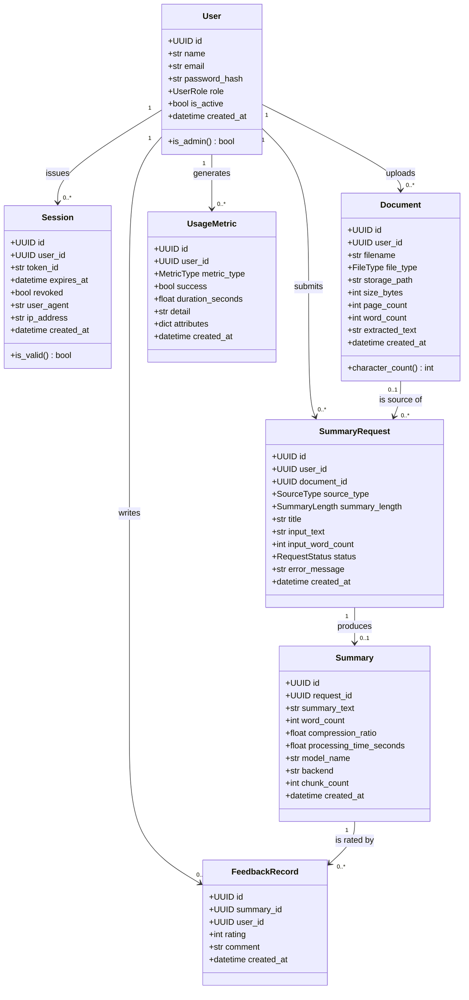
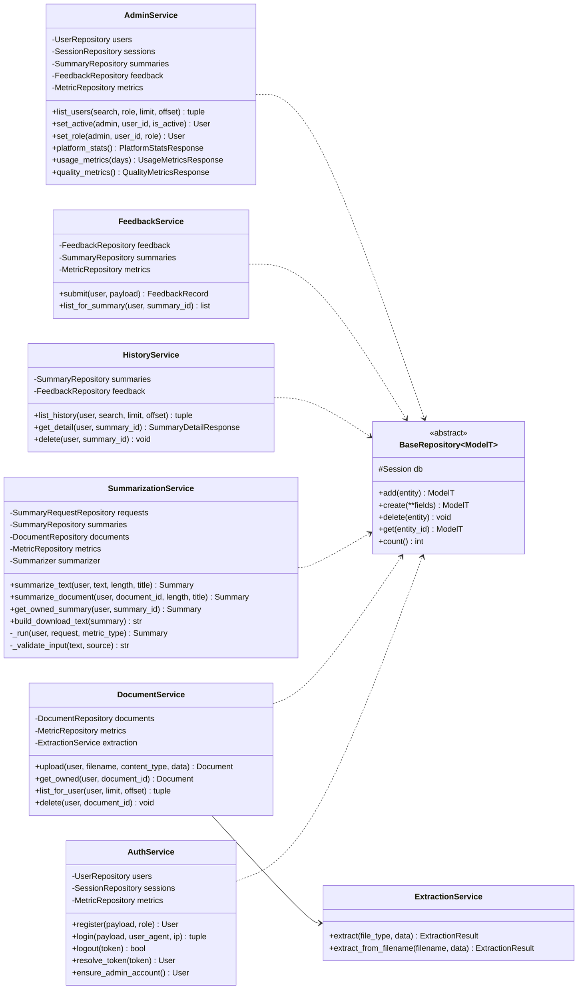
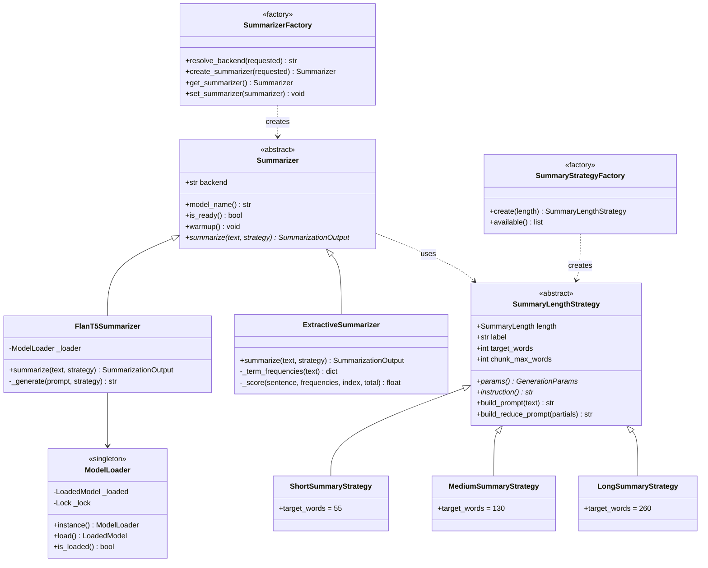
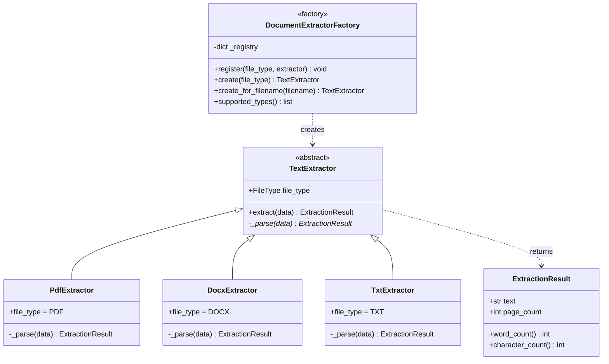
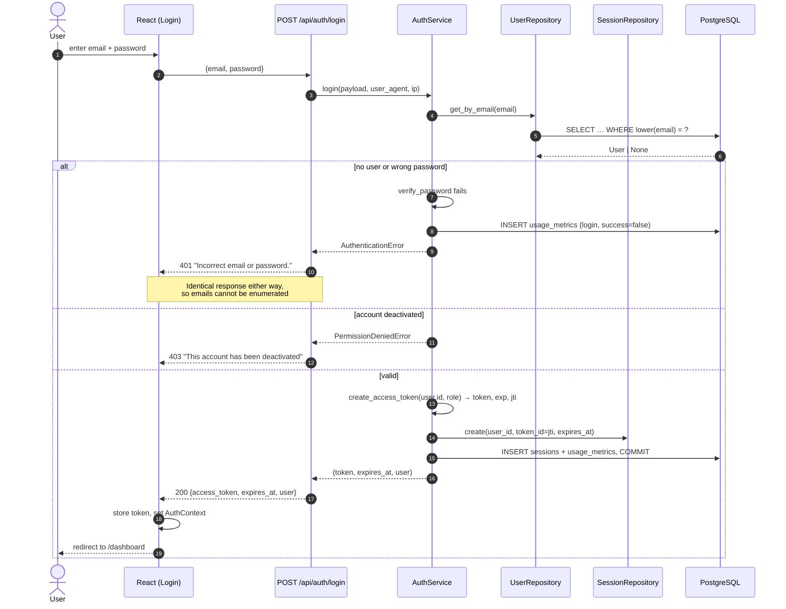
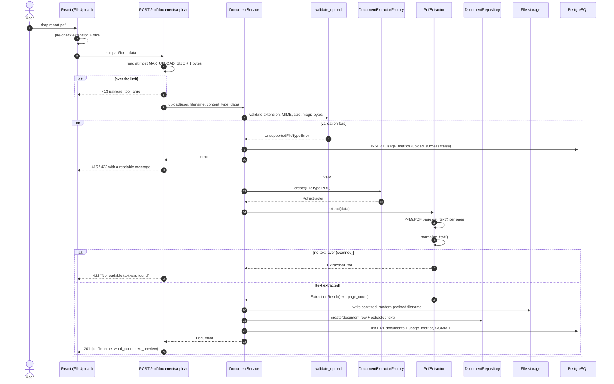
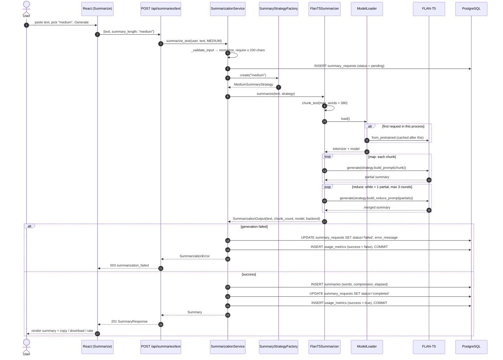
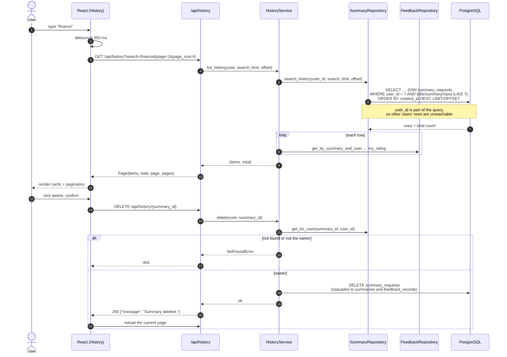
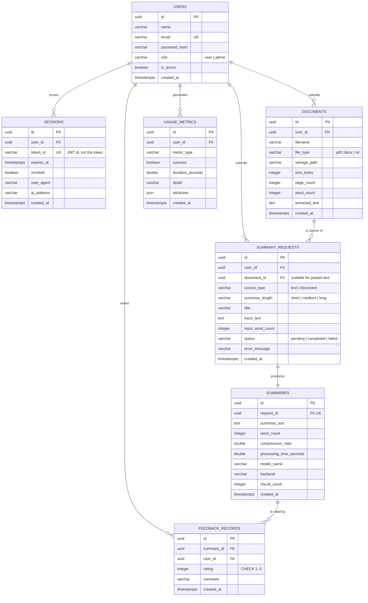

# UML diagrams

Every diagram here reflects the code as implemented — the class names, attributes and method
names match the source files. Mermaid renders directly on GitHub.

---

## 1. Use case diagram

```mermaid
flowchart LR
    USER(("Registered<br/>user"))
    ADMIN(("Administrator"))
    CI(("CI pipeline"))
    MODEL[["FLAN-T5<br/>(supporting actor)"]]

    subgraph platform["CloudMLOps platform"]
        UC1["UC-01 Register"]
        UC2["UC-02 Log in"]
        UC3["UC-03 Log out"]
        UC4["UC-04 Submit raw text"]
        UC5["UC-05 Upload document"]
        UC6["UC-06 Generate summary"]
        UC7["UC-07 Select summary length"]
        UC8["UC-08 View summary"]
        UC9["UC-09 Download summary"]
        UC10["UC-10 View history"]
        UC11["UC-11 Search history"]
        UC12["UC-12 Delete summary"]
        UC13["UC-13 Rate summary"]
        UC14["UC-14 Manage users"]
        UC15["UC-15 Monitor usage"]
        UC16["UC-16 Automated testing"]
    end

    USER --- UC1
    USER --- UC2
    USER --- UC3
    USER --- UC4
    USER --- UC5
    USER --- UC6
    USER --- UC8
    USER --- UC9
    USER --- UC10
    USER --- UC11
    USER --- UC12
    USER --- UC13

    ADMIN --- UC2
    ADMIN --- UC14
    ADMIN --- UC15

    CI --- UC16

    UC4 -. "«include»" .-> UC6
    UC5 -. "«include»" .-> UC6
    UC6 -. "«include»" .-> UC7
    UC6 --> MODEL
    UC10 -. "«extend»" .-> UC11
    UC8 -. "«extend»" .-> UC9
    UC8 -. "«extend»" .-> UC13
```

---

## 2. Domain class diagram (data tier)

---

## 3. Business tier class diagram

Eight services plus the AI abstractions. Note that no service depends on FastAPI.

### AI tier — Strategy and Factory

### Document extraction — Factory

---

## 4. Sequence — login (UC-02)

---

## 5. Sequence — document upload (UC-05)

---

## 6. Sequence — AI summarization (UC-06 / UC-07)

---

## 7. Sequence — history search and delete (UC-11 / UC-12)

---

## 8. Entity relationship diagram

### Normalization notes

The schema is in third normal form:

- Every table has a single-column UUID primary key and no repeating groups (1NF).
- No non-key column depends on part of a key, because no table has a composite key (2NF).
- No non-key column depends on another non-key column (3NF). In particular, derived values
  like `word_count` and `compression_ratio` are stored on `summaries` deliberately: they are
  a **snapshot of what the model produced at that moment**, not a function of the current
  `summary_text`, so recomputing them later could silently change history.
- `feedback_records` carries `UNIQUE (summary_id, user_id)`, which is what makes re-rating an
  update instead of a duplicate row.
